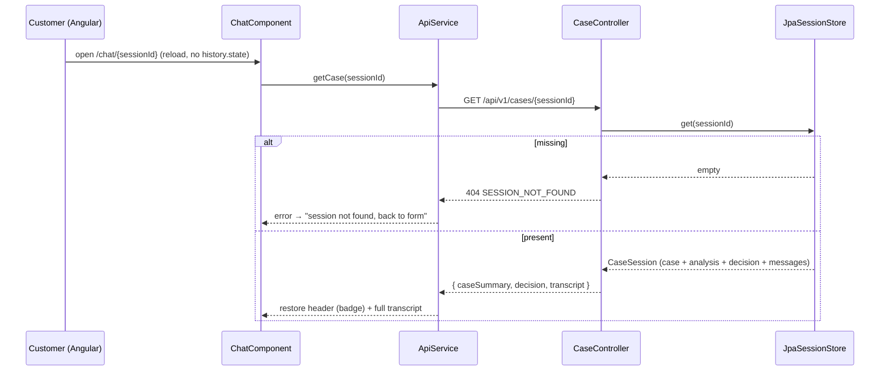

# ADR-004: Session Persistence (H2 file-backed via Spring Data JPA)

**Date:** 2026-06-25
**Status:** Accepted
**Relates to:** [`000-main-architecture.md`](000-main-architecture.md), [`001-backend-api.md`](001-backend-api.md), [`003-frontend.md`](003-frontend.md)
**Supersedes:** the "Server-side in-memory session store" decision in [`000-main-architecture.md`](000-main-architecture.md) §8.

---

## 1. Scope

Implements the first **Backlog** item from the PRD (§12): **session & decision persistence**. It makes a case — form data, image analysis, decision, and the full chat transcript — durable so a customer who reopens `/chat/{sessionId}` (reload, deep link, or after a backend restart) sees the conversation exactly where they left off.

Covers: the storage engine choice (**H2**, file-backed), the persistence layer (Spring Data JPA behind the existing `SessionStore` seam), the schema, two backend correctness fixes required for restore to actually work, the `GET /api/v1/cases/{id}` contract change, retention, and what is explicitly **not** in this ADR (the image bytes and the future vector/RAG store).

It does **not** decide the vector/embeddings store for the future RAG knowledge base — that is deferred to a separate ADR (see §8).

---

## 2. Context

The MVP shipped with a server-side **in-memory** `SessionStore` (000 §8) behind a `SessionStore` interface that was explicitly designed as the seam for durable persistence. Three gaps prevent restore today:

1. **No durability** — `InMemorySessionStore` is a `ConcurrentHashMap`; everything is lost on backend restart, and nothing is shared across instances.
2. **Assistant chat replies are never saved** — `ChatService.streamChat` appends the *user* message but the streamed *assistant* answer is discarded, so even an in-process reload would lose half the transcript.
3. **The frontend never restores from the URL** — `ChatComponent` only reads `history.state` (the navigation fast-path); on reload it renders blank, and `ApiService` has no `getCase()` call.

This ADR closes gap 1 (durable store) and gap 2 (persist assistant replies). Gap 3 (frontend wiring) is a frontend change tracked in the implementation plan and reflected in the `GET` contract here (§5).

The PRD originally named **SQLite** as the example engine ("e.g. in SQLite"). That suggestion is **withdrawn** — see §6.

---

## 3. Context7 / Reference Handles

| Library | Handle | Used for |
|---|---|---|
| Spring Boot | `/spring-projects/spring-boot` | `spring-boot-starter-data-jpa`, datasource + JPA auto-config |
| H2 Database | resolve at impl time (`com.h2database:h2`) | Embedded file-backed relational store |
| Hibernate ORM | bundled with Spring Boot | Entity mapping, `AttributeConverter` for JSON columns |

H2 is pure-Java and needs no native libraries; the `com.h2database:h2` jar is the only runtime dependency added.

---

## 4. Decision

### 4.1 Engine: H2, file-backed
Use **H2 in file mode** (`jdbc:h2:file:./data/copilot`) as the durable store, accessed through **Spring Data JPA** (`spring-boot-starter-data-jpa` + `com.h2database:h2`).

Rationale:
- **Pure Java, zero native dependencies** — no platform-specific binaries to ship or load; valuable for an NBP / possibly air-gapped target.
- **First-class Spring Boot integration** — auto-configured datasource, JPA, and dialect; no third-party Hibernate dialect needed.
- **Full DDL support** — H2 supports `ALTER`/`DROP COLUMN`, so Hibernate `ddl-auto` works during the MVP (SQLite does not — see §6).
- **Single file** — simple to back up, delete, or reset; fits the single-instance MVP.

### 4.2 Persistence layer: JPA behind the existing `SessionStore` seam
Add a `JpaSessionStore implements SessionStore` as the default (active outside the `test` profile); keep `InMemorySessionStore` for fast unit/slice tests. Orchestration code (`CaseService`, `ChatService`) is **unchanged** — it depends only on the `SessionStore` interface, exactly as 000/001 intended.

- The domain model (`CaseSession`, `ChatMessage`) stays a clean POJO/record; JPA entities (`CaseSessionEntity`, `ChatMessageEntity` in a `@OneToMany` with ordered messages) live in the `session` package and are mapped to/from the domain by `JpaSessionStore`.
- `ImageAnalysis` and `DecisionResult` are persisted as **JSON columns** via a Jackson `AttributeConverter`. They are nested value objects with enums that we only ever read back whole (to rebuild the chat agent's context after a restart and to render the decision badge) — we never query *inside* them, so JSON avoids a wide flattened schema and brittle migrations.
- **Both `ImageAnalysis` and `DecisionResult` are persisted** (not just the transcript). Without them, the chat agent would lose the case context it needs to answer follow-ups after a restart.

### 4.3 Schema management: `ddl-auto=update` for the MVP
Use Hibernate `ddl-auto=update` for now (H2 supports the required DDL). **Flyway** is noted as the production-hardening follow-up once the schema stabilizes or a real audit/retention policy lands.

### 4.4 Retention: keep indefinitely (for now)
Sessions and transcripts are **kept indefinitely** in the MVP. Retention / anonymization / purge is an **open question** to resolve with NBP compliance before any real deployment (see §9 and PRD §12 open questions). No TTL or cleanup job is built now.

### 4.5 Image bytes are NOT persisted
The uploaded photo continues to be compressed, sent to the vision model, and discarded — it is **not** stored. Consequences: the case-summary header restores the **form data** (type, category, model, purchase date) and the decision, but **not a photo thumbnail**. Durable image storage (ideally an **S3-compatible blob store**, with only a reference in the DB) is a new PRD backlog item, deliberately out of scope here to keep the change small and limit privacy exposure of customer device photos.

---

## 5. Interface / Contract Changes

### `GET /api/v1/cases/{sessionId}` — extended response
The endpoint already returns the case for in-session reload; it is extended so the frontend can rebuild the chat screen **identically** to the post-submit state (header badge, decision highlight, full transcript).

| Field | Type | Notes |
|---|---|---|
| `caseSummary` | object | `type, category, model, purchaseDate` (unchanged) |
| `decision` | object | `category, justification, nextSteps, missingInfo` — **added** (previously omitted), needed for the decision badge/highlight on restore |
| `transcript` | `ChatMessage[]` | full ordered transcript: first decision message + all user/assistant turns |

`404 SESSION_NOT_FOUND` is returned for an unknown id (unchanged); the frontend handles it with a friendly "session not found → back to form".

### `ChatService` — persist the assistant reply (correctness fix)
`streamChat` must accumulate the streamed token deltas and, on stream completion, append the full assistant message to the store (`SessionStore.appendMessage`). This applies to both `OpenRouterLlmGateway` and `StubLlmGateway`. The user message continues to be appended before streaming. This realizes the "Append assistant message" step already drawn in the 000/001 sequence diagrams.

---

## 6. Why NOT SQLite (the withdrawn suggestion)

The PRD floated SQLite ("e.g. in SQLite"), partly because it has vector-search extensions and could double as the future knowledge-base store. After research (2026-06-25) we reject SQLite for this project:

- **Vector search in SQLite is not production-ready *from Java*.** `sqlite-vec` (the active successor to `sqlite-vss`) is a C loadable extension. Driving it through the standard `org.xerial:sqlite-jdbc` driver is still an **open, unresolved discussion** ([xerial/sqlite-jdbc #1212](https://github.com/xerial/sqlite-jdbc/issues/1212)); it requires enabling the `load_extension` SQL function — a **SQL-injection attack surface** that is unwelcome in an NBP context — and bundling per-platform native binaries by hand. The "one store for sessions *and* vectors" argument therefore does not hold on our Java/Spring stack.
- **SQLite needs a third-party Hibernate dialect** (`hibernate-community-dialects`) and **cannot drop or alter columns**, which breaks Hibernate `ddl-auto` and complicates schema evolution.
- **It ships native binaries.** H2 is pure Java, which is simpler to deploy and audit.

Once the vector argument is removed (see §8, vectors decoupled), SQLite offers no advantage over H2 for a relational session/audit store, and several disadvantages. We therefore **scrub SQLite from the authoritative docs** (ADR 000/001, README, PRD, AGENTS.md) so future agents are not misled into reintroducing it. *(Historical research under `course-materials/` is left intact — it is a record of the survey and useful input to the future vector ADR below.)*

### Alternatives considered
- **H2 (chosen)** — pure Java, full DDL, first-class Spring Boot, single file. (−) H2's own file format is less universally inspectable than a `.sqlite` file, and it has no native vector type — irrelevant because vectors are decoupled (§8).
- **SQLite + JPA** — portable, inspectable file, but the problems above; vector future is a trap in Java.
- **PostgreSQL + pgvector** — the strongest long-term vector story and real concurrency, but it needs a **running server**, contradicting the single-file, single-process MVP intent. A likely candidate **if** the future vector ADR picks pgvector — at which point sessions could migrate to Postgres too. Not now.

---

## 7. Diagrams

### Component — persistence behind the seam
```mermaid
flowchart TD
    APP[CaseService / ChatService] --> SS[SessionStore «interface»]
    SS <|.. JPA[JpaSessionStore «default»]
    SS <|.. MEM[InMemorySessionStore «test profile»]
    JPA --> REPO[CaseSessionRepository «Spring Data JPA»]
    REPO --> H2[(H2 file: ./data/copilot)]
    JPA -. JSON columns .- CONV[Jackson AttributeConverter\nImageAnalysis / DecisionResult]
```

### Sequence — restore on reload / deep link


---

## 8. Future Vector / RAG Store — Deferred to a Separate ADR

The PRD backlog includes an **agent RAG knowledge base** (semantic/hybrid search over electronics specs and detailed procedures). The embeddings/vector-store technology for that is **explicitly NOT decided here** and must be its own ADR after dedicated research, because:

- **It is a different concern** from transactional session/audit storage. Coupling the two (the original "use SQLite for both" idea) would have forced a weak vector engine on us purely to share a file.
- **The Java landscape needs evaluation on its own terms** — likely via **Spring AI's `VectorStore`** abstraction: a file-based `SimpleVectorStore` for a small local KB, or **pgvector** / Chroma / a dedicated store if it grows. `course-materials/Research/RAG with re-ranking and hybrid search in Java.md` is the starting input for that research.

**Decision recorded here:** session persistence (this ADR) and the vector store (future ADR) are **decoupled**. Choosing H2 now imposes **no constraint** on the future vector choice.

---

## 9. Consequences

**Positive**
- Customers can reload / deep-link / survive a backend restart and resume exactly where they left off.
- Durable, structured case records (form + analysis + decision + transcript) — the foundation of the audit trail the PRD wants for *Needs human review* handoff.
- Orchestration code untouched; the change lives behind the `SessionStore` seam, validating the original architecture.

**Negative / trade-offs**
- A new file artifact (`./data/copilot.mv.db`) and a JPA dependency to manage; `.gitignore` must exclude the data file.
- `ddl-auto=update` is convenient but not a real migration strategy — Flyway follow-up flagged.
- No retention/anonymization yet — **open compliance question** before real deployment.
- No image thumbnail on restore until the S3 image-storage backlog item lands.

**Review triggers**
- Running more than one backend instance (H2 file is single-instance) → move to a server DB (Postgres).
- The future vector ADR selecting pgvector → consider consolidating sessions onto Postgres.
- NBP defines retention/audit requirements → add Flyway + TTL/purge or anonymization.

---

## 10. Testing Strategy

| Scenario | Type | Expected |
|---|---|---|
| Round-trip persistence | `@DataJpaTest` (in-memory H2) | A saved `CaseSession` (case + `ImageAnalysis` + `DecisionResult` + messages) reloads field-for-field, including JSON-column value objects |
| Ordered transcript | Unit/slice | `appendMessage` preserves insertion order across user/assistant turns |
| Assistant reply persisted | Integration (stub/WireMock SSE) | After a streamed chat turn completes, the store contains the full assistant message |
| `GET` contract | Integration (MockMvc) | Response includes `caseSummary`, `decision`, and the full `transcript`; unknown id → 404 |
| Restore on reload | FE unit (API mocked) | With no `history.state`, `ChatComponent` calls `getCase`, repopulates header + messages; 404 → back-to-form |
| Full journey + reload | E2E (Playwright, **real stack, LLM not stubbed**) | Submit → chat → follow-up → reload `/chat/{id}` shows the complete transcript and decision header |

### Technical acceptance criteria
- **TAC-004-01:** A `CaseSession` persisted via `JpaSessionStore` is recoverable after a fresh `SessionStore` instance / process restart (durability).
- **TAC-004-02:** `ImageAnalysis` and `DecisionResult` survive the round-trip with all fields/enums intact (JSON-column converter).
- **TAC-004-03:** A completed chat turn results in **both** the user and the assistant message being stored, in order.
- **TAC-004-04:** `GET /api/v1/cases/{id}` returns `decision` alongside `caseSummary` and the full `transcript`; unknown id → `404 SESSION_NOT_FOUND`.
- **TAC-004-05:** The image bytes are **not** persisted anywhere (no BLOB column, no file written).
- **TAC-004-06:** No SQLite dependency or `load_extension` usage exists in the build or runtime.
